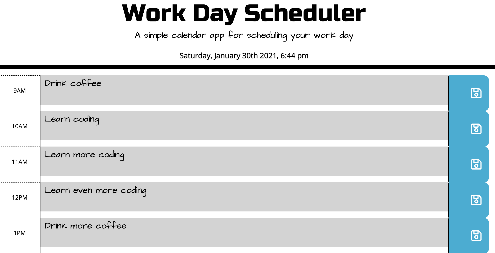

# work-day-scheduler

## Description

This is my fifth homework assignment for the University of Denver Web Development Boot Camp!  

For this project, I was asked to build a simple daily planner someone could use to schedule activities for each hour of their day. The site and styling were of course built using HTML and CSS (with a Bootstrap grid), and utilizes both jQuery and Javascript to provide functionality.  

One cool feature of this project is that I used momentJS to enable a functionality which color-codes the different time blocks depending on whether they are before, after, or equal to the present time. Another nice aspect is that the user's events are stored in local storage, so if the page gets refreshed they will not lose their events. In addition to the button that saves the user's event, I also added a delete button which clears the event the user entered.

## Deployment

The code (and associated assets) are hosted right here in this GitHub repository, and it's all live on the web thanks to GitHub pages. If you would like to check it out, you can view the site at the link below:

<a href="https://lukeoxner.github.io/work-day-scheduler" target="_blank"><b>work-day-scheduler Live Website</b></a>
  

## Credits

This project was made using HTML, CSS, Javascript, and jQuery.
